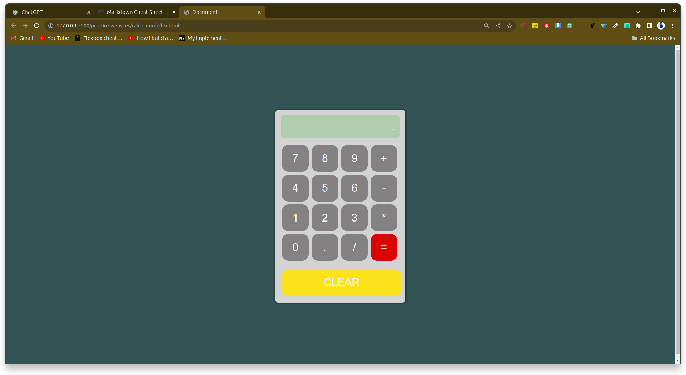

# Introduction

This documentation explains the functionality of a simple calculator implemented in JavaScript. The calculator allows users to input mathematical expressions, perform calculations, and clear the input. The code leverages a forEach loop to set up event listeners for buttons.

# Code Overview

`const screenDisplay = document.querySelector('.screen');
const buttons = document.querySelectorAll('button');

let calculation = [];
let cumulativeCalculation;

function calculate(button) {
    // Function logic here
}

buttons.forEach(button => button.addEventListener('click', () => calculate(button)));
`
# Key Components

- screenDisplay: Represents the display element where the calculator output is shown.
- buttons: Contains a NodeList of all button elements on the page.
- calculation: An array to store user input.
- cumulativeCalculation: Stores the cumulative input string.
- calculate(button): A function to handle button clicks and perform calculations.
- buttons.forEach(...): Sets up click event listeners for each button

# How It Works

1. Initialization: The script initializes variables and selects HTML elements.

2. calculate(button) Function:

- The calculate function takes a button parameter representing the clicked button.
- It extracts the text content of the button, which determines the action.
- Depending on the button's value:
- "CLEAR" button clears the calculation and screen display.
- "=" button evaluates the cumulative calculation and displays the result.
- Other buttons append their values to the calculation and update the screen.

3. buttons.forEach(...) Loop:

- The forEach loop iterates over each button in the NodeList.
- For each button, it sets up a click event listener that calls the calculate function with the clicked button as an argument.

# Dry Run Example

- User Interaction:
    
- The user clicks on "1".

    value becomes "1".

    calculation becomes ["1"].

    cumulativeCalculation becomes "1".

    The screen displays "1".
    
-  The user clicks on "+".
    
    value becomes "+".

    calculation becomes ["1", "+"].

    cumulativeCalculation becomes "1+".

    The screen displays "1+".

-  The user clicks on "2".

    value becomes "2".

    calculation becomes ["1", "+", "2"].

    cumulativeCalculation becomes "1+2".

    The screen displays "1+2".
    
-   The user clicks on "=".

    value becomes "=".
    
    The eval function evaluates "1+2" to 3.

    The screen displays "3".

-    The user clicks on "CLEAR".

    value becomes "CLEAR".
    
    calculation is cleared ([]).

    The screen displays ".".

# Conclusion

This JavaScript code implements a simple calculator with basic arithmetic operations. It uses a forEach loop to set up 

event listeners for buttons, allowing users to interact with the calculator.

You can check this calculator in action on this website.

